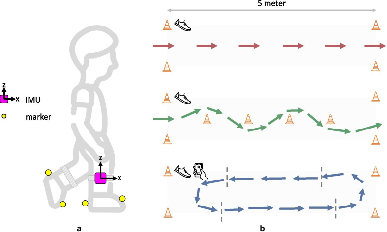

::: {.callout-tip}
## Novelty

To our best knowledge, we were the first to show that gait events could be detected from an ankle-worn inertial measurement unit in straight walking, and also slalom and curved walking, under both single- and dual-task conditions in healthy older adults, people with Parkinson's disease and people who had suffered a stroke.
:::

## Background
Balance and gait deficits are ubiquitous among the older population, and lead to enormous personal, occupational and health care burden. Emerging pharmacological and non-pharmacological interventions to date have only small to moderate effects on these deficits. This is likely due to remaining fundamental questions on underlying mechanisms and treatment.

Keep Control was an EU-funded industrial academic initial training network aiming to gain a better understanding and treatment of balance and gait deficits in older adults

## Aims
The focus of my part was two-fold:  

::: {.callout-important}
## Aims
1. Determine the feasibility of a patient-managed electronic health record system for use in gait-related research.  
2. Develop algorithms to detect gait from inertial measurement unit data.  
:::

## Outcomes

### Patient-managed electronic health records

::: {#fig-pkb-example}

An elderly couple managing their electronic health records.
:::

- We found that the use of patient-managed electronic health records was compromised by the **digital literacy** of older adults. Furthermore, the integration of the tool in applied research was complicated, because the health record system does not communicate with the data collection tools that are typically used in biomechanics research.

### Algorithm development

::: {#fig-keep-control-example}

Schematic illustation of the experimental setup for developing the gait detection algorithms.

:::

- We developed algorithms to detect gait events, i.e., initial foot contact, and final foot contact, from inertial measurement units attached to the lower back, to the ankle and to the foot. The algorithms were validated against an marker-based reference system achieving **>95% precision** for straight and curved walking under both single- and dual-task conditions in people with Parkinson's disease and people who had a stroke.