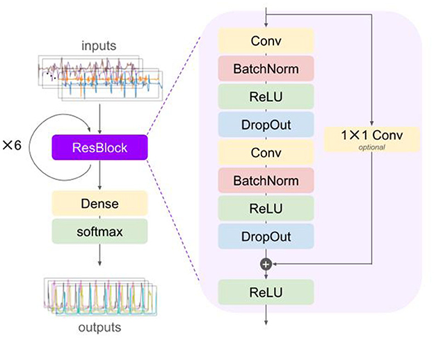

::: {.callout-tip}
## Novelty
The validation of inertial measurement unit (IMU)-based gait events detection is largely based on in-laboratory evaluation against established reference methods. The limitation of these validations is that the observed walking does not reflect how people move about in their own home environment. Here, we have shown that our **deep learning** approach reaches excellent sensitivity and sensitivity in the *free-living environment** thereby contributing to the ecological validity of these algorithms.
:::

## Background
The clinical assessment of mobility, and walking specifically, is mainly based on functional tests that lack ecological validity. Thanks to inertial measurement units (IMUs), gait analysis is shifting to unsupervised monitoring in naturalistic and unconstrained settings. We have developed a deep learning (DL) algorithm for gait event detection in a heterogeneous population of different mobility-limiting diseases. The results showed a high detection performance for initial contacts (ICs) (recall: 98%, precision: 96%) and final contacts (FCs) (recall: 99%, precision: 94%) and a maximum median time error of $-$0.02 s for ICs and 0.03 s for FCs. 

## Methods

:::

:::

We developed deep learning algorithm based on the architecture of a temporal convolutional network (TCN). The model was first validated on an in-lab collected dataset to establish its general validity and then fine-tuned on a dataset where people were assessed for about 2.5 hours in their own home environment.